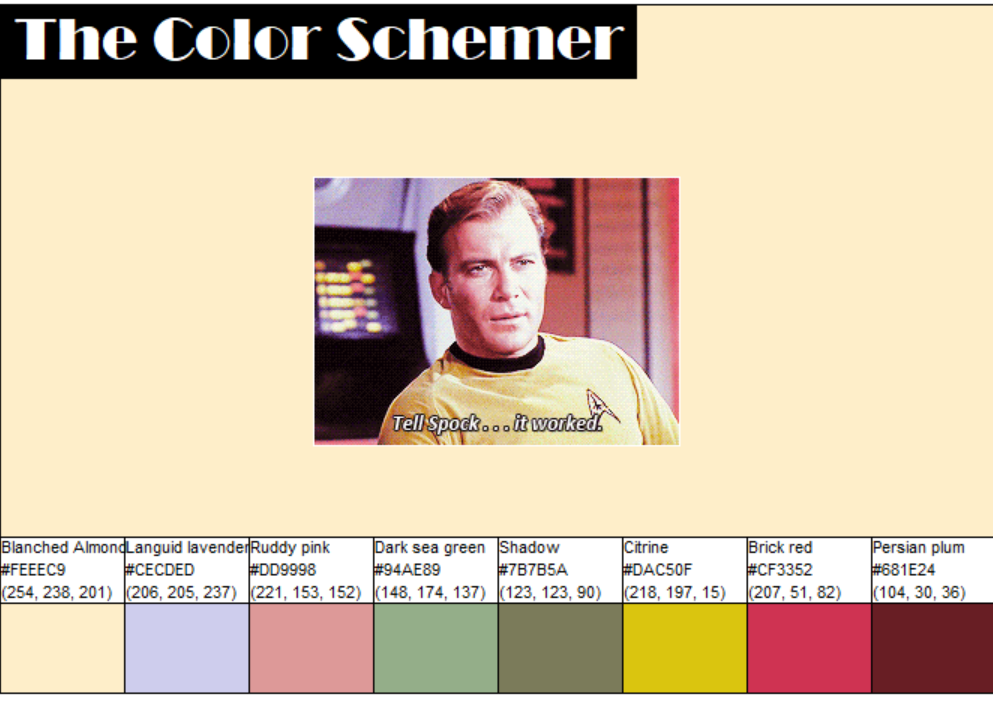
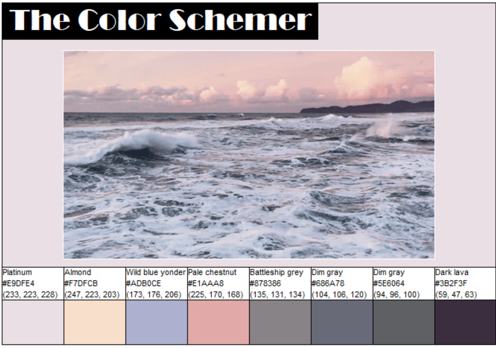
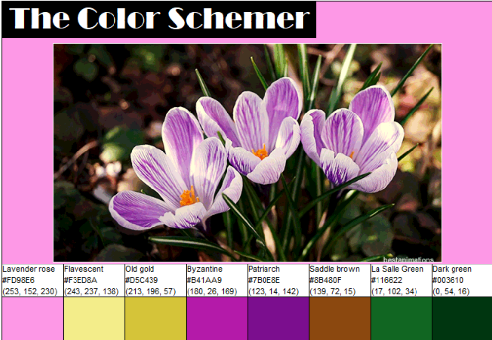

## Project Summary
Takes an image and outputs a "color scheme" of the most prominent colors in an image

## Motivation
I have often looked at images and wished I could get a color palette of the most prominent colors so I could channel that color scheme in a painting or other design project so I set out to create a program that does just that

## Code Example (Clustering Algorithm)

    # weighting colors that make up over 10% of the image less
    
    # initializing vars
    cutPix = []
    dict = {}
    
    # loopinng through all the pixels
    for p in allPix:
        
        # creating a dictionary with all the pixels and the number of times
        # they appear in allPix
        if p in dict:
            dict[p]+=1
        else:
            dict[p] =1
    
    # the cutOff for a "large" amount of a color is if it makes up about over
    # 20% of all the pixels
    cutOff = int(len(allPix)*(20/100))
    
    for k in dict:
        
        # if the count of the pixel is greater than the cutoff
        if(dict[k] > cutOff):
            # add that pixel 2% less than it appears in allPix, or in other words
            # only include 98% of the iterations of that pixel
            for i in range(int(0.98*dict[k])): cutPix.append(k)
        else:
            # otherwise add it the original amount of times it appears in allPix
            for i in range(dict[k]): cutPix.append(k)
    
    
    # loop through all the pixels
    for p in cutPix:
        # we will start with the max distance and max pix values
        minDist = pixDist(255,255,255,0,0,0)
            
        for c in range(len(centroids)):
            r1,g1,b1 = centroids[c]
            r2,g2,b2 = p
            
            # find the pixels distance to the current centroid
            dist = pixDist(r1,g1,b1,r2,g2,b2)
            
            # if the pix distance from the centroid < the min distance btwn
            # that pix and the other centroids then make that dist the minDist
            # and that centroid the closest centroid
            if(dist < minDist):
                minDist = dist
                index = c # represents index of cluster list OR index of which centroid closest to
                
        # add that pixel to the closest centroid
        clusters[index].append(p)
            
        # change the centroid to average together 
        r1,g1,b1 = centroids[index]
        r2,g2,b2 = p
        
        # taking avg of old centroid and new cluster addition to
        # get new centroid
        centroids[index] = (r1+r2)//2,(g1+g2)//2,(b1+b2)//2   

## Output Examples

## Credits
Colors dataset used for color names is a subset of a dataset taken from https://data.world/dilumr/color-names

Yeshiva University © [Juliet Nasar]()
